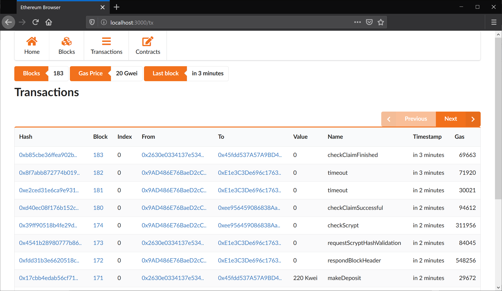

# Mini Eth Browser

A simple ethereum block and transaction explorer.
Since it doesn't use a database some operations
are slow.


[](https://travis-ci.org/ismaelbej/mini-eth-browser)



## Setup

### Install dependencies

```sh
npm install
```

### Configuration

Edit `src/config.js` to point to a ethereum node.

## Development

To execute in development mode

```
npm run dev
```

It uses `nodemon` and `create-react-app` script to
reload changes.

## Production

This may work but otherwise is not tested.

```
npm run build
npm run start
```

## Organization

The project is divided in two parts _backend_ and _frontend_.

*   _Backend_ is an _Express_ application that serves a RESTful api.
*   _Frontend_ is a _React_ application that consumes the backend api.

Both should be independent of each other, so it is easy to replace
one without affecting the other.

### Backend

The backend code is in `src/` directory. Again it is split in
two pieces:

*   _Routes_ Express routes that only have to deal with REST
    endpoints and parsing parameters. They should not dependant on
    Ethereum implementation details.

*   _Lib_ Code responsible to interact with Ethereum node and
    processing api. It is an abstraction above `web3` library
    to return processed information ready to consume.

### Frontend

The frontend code is in `client/src/`. It should be a standard
React application.

*   _Components_ Reusable components that show varios
    Ethereum objects like transactions, blocks, accounts, etc.

*   _Controllers_ Old code to handle async request from views.
    It is being passed out.

*   _Lib_ Requests to interact with backend API.

*   _Utils_ Miscelaneus utilities.

*   _Views_ High levels blocks of the frontend.
